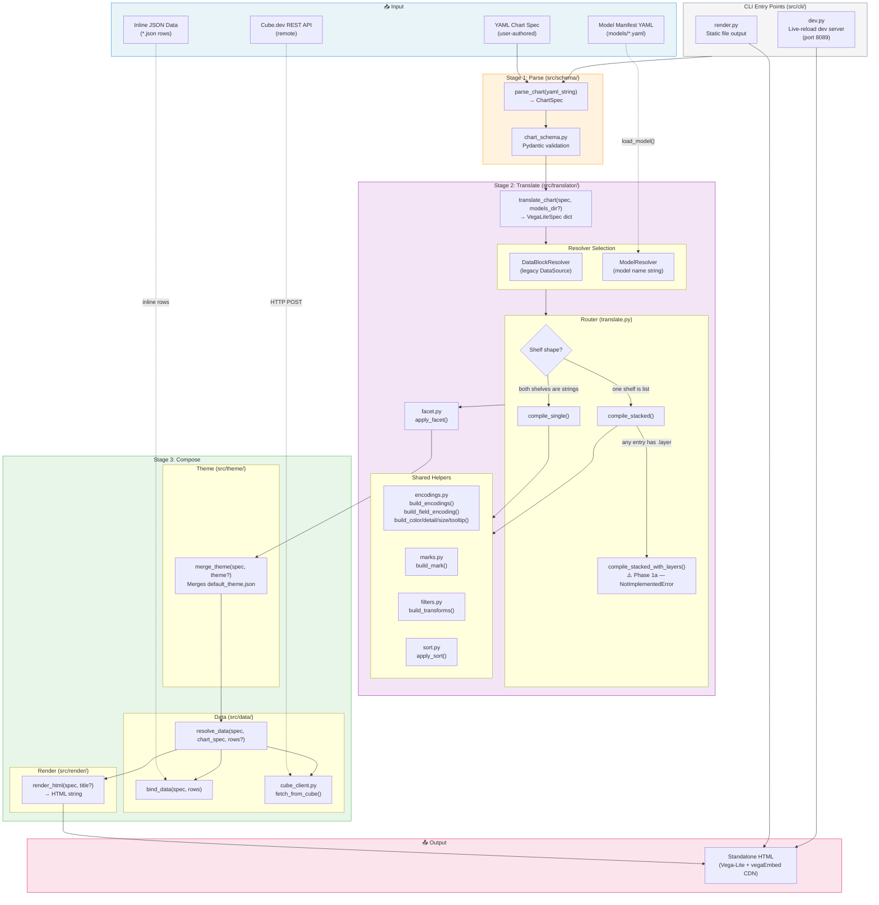
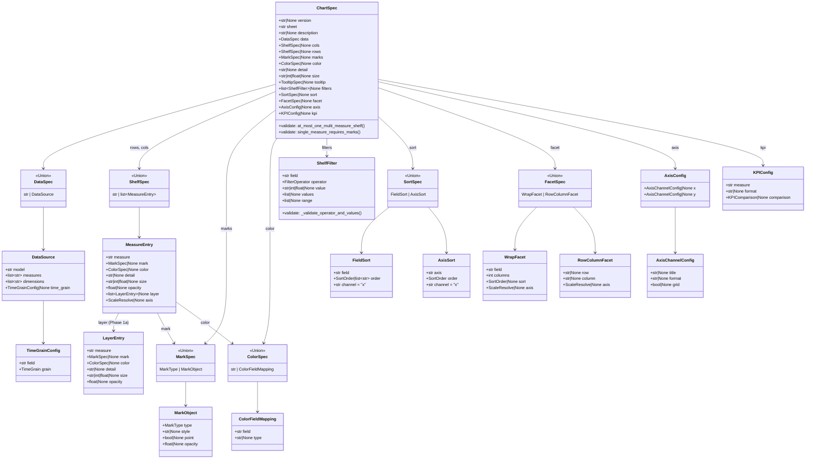
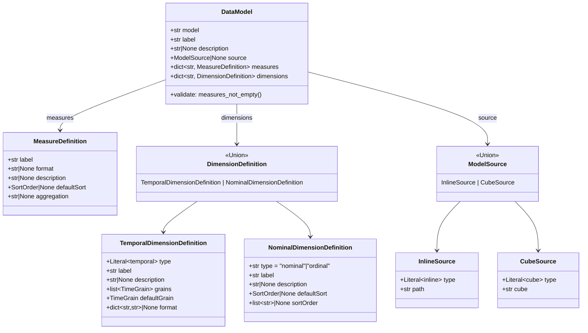
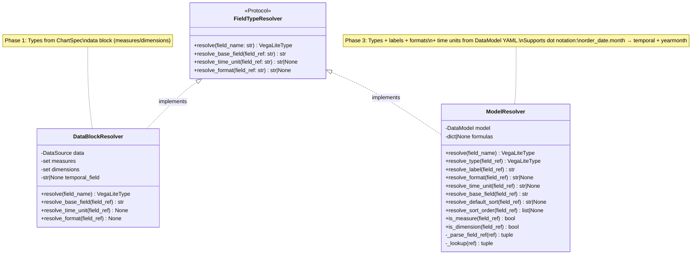
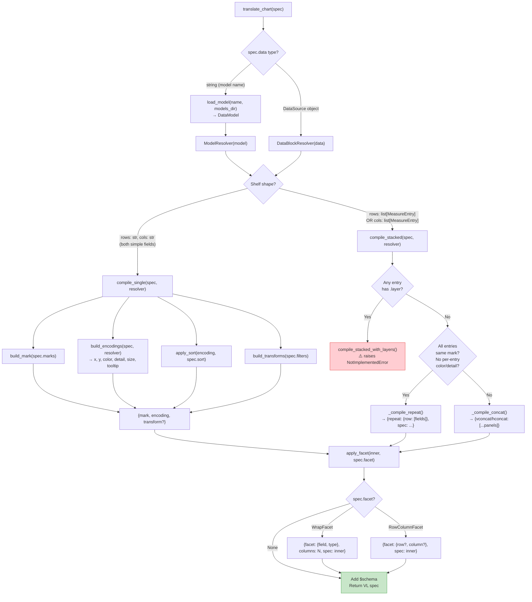
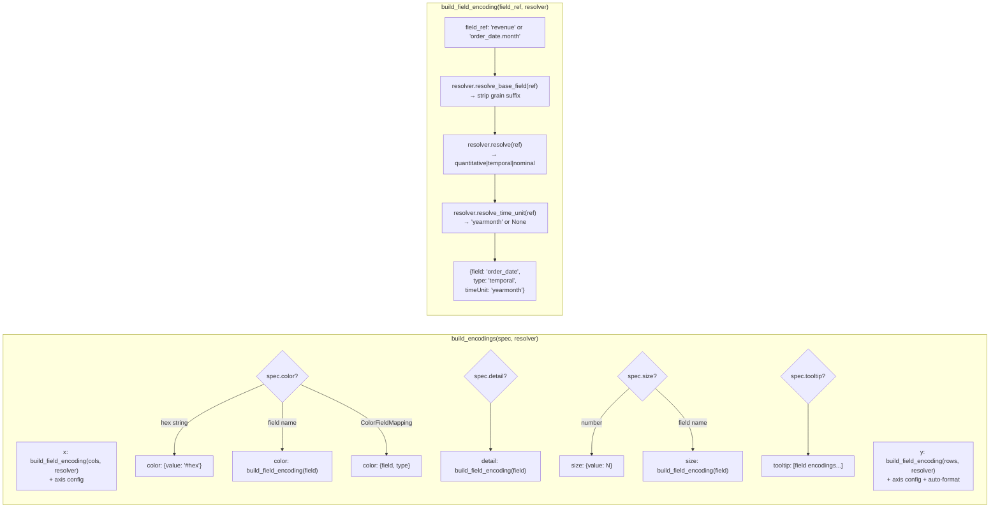
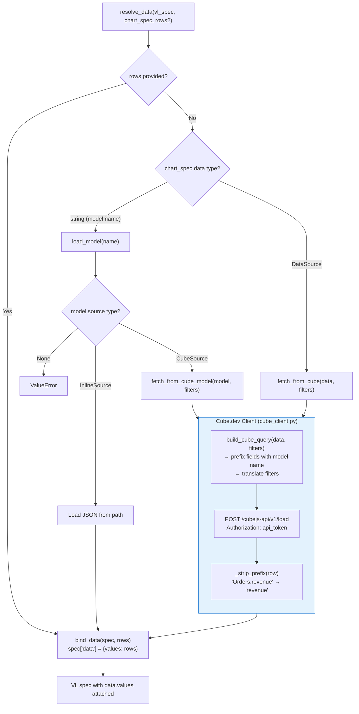
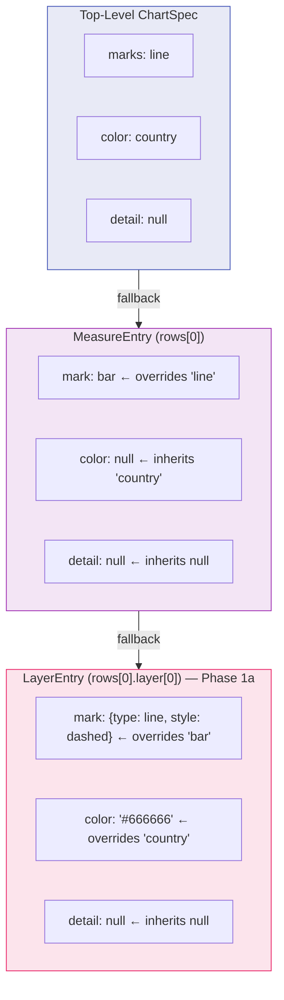
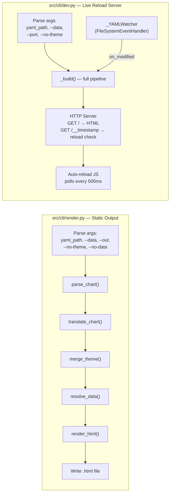
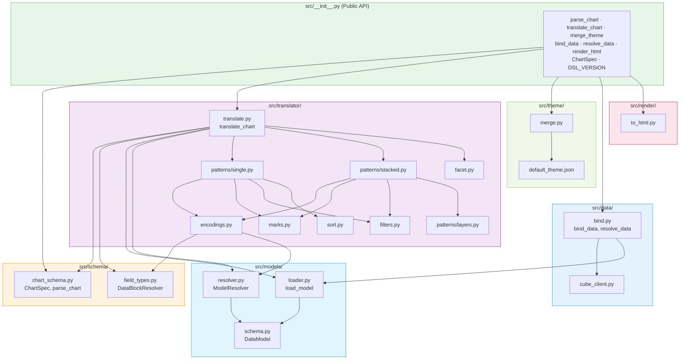

# Charter Architecture — Complete System Diagram

## 1. End-to-End Pipeline

## 2. Pydantic Model Hierarchy (ChartSpec)

## 3. Data Model Manifest Schema (src/models/)

## 4. Field Type Resolver Pattern (Protocol)

## 5. Translation Routing Decision Tree

## 6. Encoding Builder Detail

## 7. Data Resolution Flow

## 8. Inheritance Chain (Multi-Measure)

## 9. CLI Entry Points

## 10. Module Dependency Map

