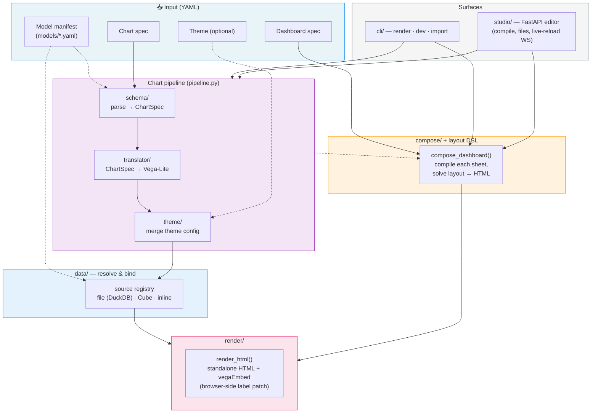
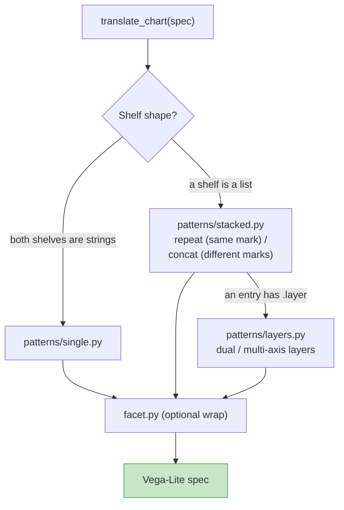

# Shelves Architecture

A high-level map of the system. For exact types and fields, read the code and
the per-module `CLAUDE.md` files — those are the source of truth and stay
current; this diagram is intentionally coarse so it doesn't go stale on every
schema change.

Shelves compiles a YAML DSL into Vega-Lite charts and HTML dashboards. There are
two top-level artifacts: a **chart** (one sheet) and a **dashboard** (a layout
tree of sheets). Both read field types, formats, and sources from a shared
**semantic model**, which is backed by either a flat file (DuckDB) or Cube.dev.

## 1. Subsystems

```mermaid
flowchart TB
    subgraph INPUT["📥 Input (YAML)"]
        CHART_YAML["Chart spec"]
        DASH_YAML["Dashboard spec"]
        MODEL_YAML["Model manifest<br/>(models/*.yaml)"]
        THEME_YAML["Theme (optional)"]
    end

    subgraph CHARTPIPE["Chart pipeline (pipeline.py)"]
        SCHEMA["schema/<br/>parse → ChartSpec"]
        TRANSLATE["translator/<br/>ChartSpec → Vega-Lite"]
        THEME["theme/<br/>merge theme config"]
        SCHEMA --> TRANSLATE --> THEME
    end

    subgraph DATA["data/ — resolve & bind"]
        SOURCES["source registry<br/>file (DuckDB) · Cube · inline"]
    end

    subgraph DASH["compose/ + layout DSL"]
        COMPOSE["compose_dashboard()<br/>compile each sheet,<br/>solve layout → HTML"]
    end

    subgraph RENDER["render/"]
        HTML["render_html()<br/>standalone HTML + vegaEmbed<br/>(browser-side label patch)"]
    end

    subgraph SURFACES["Surfaces"]
        CLI["cli/ — render · dev · import"]
        STUDIO["studio/ — FastAPI editor<br/>(compile, files, live-reload WS)"]
    end

    MODEL_YAML -.-> SCHEMA
    MODEL_YAML -.-> SOURCES
    THEME_YAML -.-> THEME
    CHART_YAML --> SCHEMA
    DASH_YAML --> COMPOSE
    THEME --> SOURCES
    SOURCES --> RENDER
    COMPOSE --> RENDER
    CHARTPIPE -.-> COMPOSE
    CLI --> CHARTPIPE
    CLI --> COMPOSE
    STUDIO --> CHARTPIPE
    STUDIO --> COMPOSE

    style INPUT fill:#e8f4f8,stroke:#2196F3
    style CHARTPIPE fill:#f3e5f5,stroke:#9C27B0
    style DATA fill:#e3f2fd,stroke:#2196F3
    style DASH fill:#fff3e0,stroke:#FF9800
    style RENDER fill:#fce4ec,stroke:#E91E63
    style SURFACES fill:#f5f5f5,stroke:#607D8B
```

## 2. Module map

| Package | Responsibility |
|---|---|
| `shelves/schema/` | DSL grammar. `chart_schema.py` (`ChartSpec`, `parse_chart`), `layout_schema.py` (`DashboardSpec`), `field_types.py` (`FieldTypeResolver` protocol), `temporal.py` |
| `shelves/models/` | Semantic model manifest: `schema.py` (`DataModel`), `loader.py`, `resolver.py` (`ModelResolver` implements `FieldTypeResolver`) |
| `shelves/translator/` | `ChartSpec` → Vega-Lite (`translate.py` + `patterns/`), dashboard → HTML (`layout*.py`), label intent (`labels.py`) |
| `shelves/theme/` | Theme load + merge into Vega-Lite config; layout/KPI tokens |
| `shelves/data/` | Field collection, source registry, adapters (DuckDB/file, Cube), inline binding |
| `shelves/render/` | Standalone HTML; browser-side label & compound-fit JS |
| `shelves/compose/` | `compose_dashboard()` — orchestrates a full dashboard from YAML |
| `shelves/pipeline.py` | `compile_chart()` — the one parse→translate→theme path shared by every surface |
| `shelves/cli/` | `render` (static), `dev` (live-reload), `import` (model from CSV/Parquet) |
| `shelves/studio/` | FastAPI editor server: compile endpoint, file I/O, live-reload WebSocket |

Public API (`shelves/__init__.py`): `parse_chart`, `translate_chart`,
`merge_theme`, `load_theme`, `bind_data`, `resolve_data`, `render_html`,
`compile_chart`, `parse_dashboard`, `translate_dashboard`, `compose_dashboard`,
`resolve_model_data`.

## 3. Chart translation routing

`translate_chart` resolves field types via a `ModelResolver`, then routes on
shelf shape. Facet wrapping applies around any inner shape.

```mermaid
flowchart TD
    START["translate_chart(spec)"] --> ROUTE{"Shelf shape?"}
    ROUTE -->|"both shelves are strings"| SINGLE["patterns/single.py"]
    ROUTE -->|"a shelf is a list"| STACKED["patterns/stacked.py<br/>repeat (same mark) /<br/>concat (different marks)"]
    STACKED -->|"an entry has .layer"| LAYERS["patterns/layers.py<br/>dual / multi-axis layers"]
    SINGLE --> FACET["facet.py (optional wrap)"]
    STACKED --> FACET
    LAYERS --> FACET
    FACET --> OUT["Vega-Lite spec"]

    style OUT fill:#c8e6c9,stroke:#43a047
```

## 4. Data resolution

`resolve_data(vl_spec, chart_spec, rows?)` either binds inline rows directly, or
loads the chart's model and fetches through the adapter registered for the
model's `source.type` (`file` → DuckDB, `cube` → Cube REST). Adapters self-register
at import. See `shelves/data/CLAUDE.md`.
